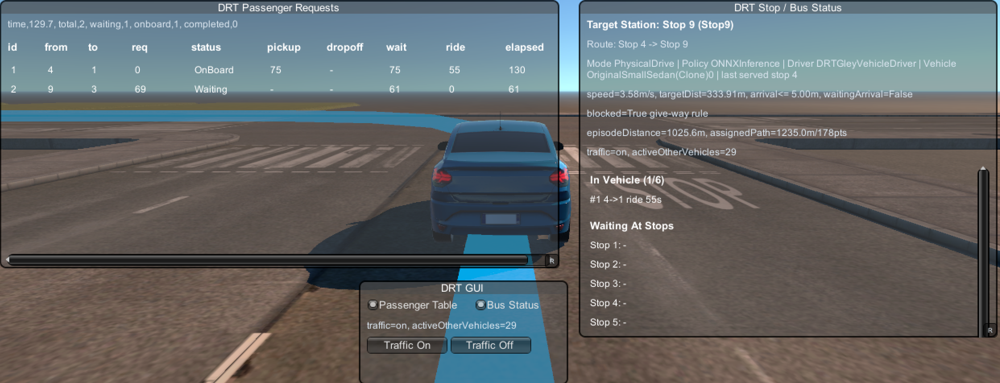
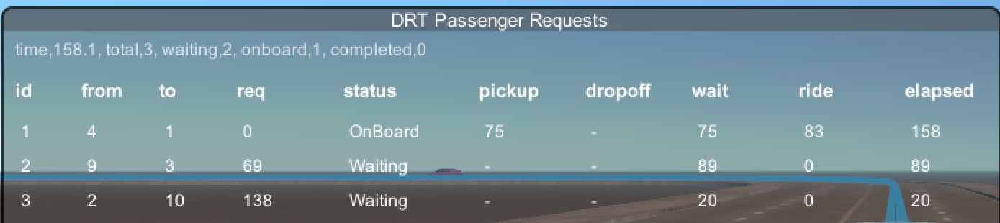

# DRT Bus Dynamic Routing Simulation

| Scene View | Game View |
|---|---|
|  |  |

## 강화학습 캡스톤 프로젝트

이 프로젝트는 Unity 기반 DRT(Demand Responsive Transit) 버스 동적 경로 생성을 위한 강화학습 캡스톤 프로젝트입니다.

목표는 고정 순환 방식인 `Vanilla Sequential`과 비교했을 때, 학습된 PPO/ONNX 정책이 현재 승객 수요를 보고 더 효율적인 다음 정류장을 선택하도록 만드는 것입니다. 비교 기준은 전체 승객 처리율을 유지하면서 평균 대기시간, 총 운행시간, 이동거리, route leg 수, reward를 얼마나 개선하는지입니다.

## MDP 관점 설계

| 구분 | 설계 |
|---|---|
| Agent | `DRTNextStopSelector`가 PPO agent로 동작하며, 버스가 다음 목적지를 정해야 할 때마다 decision을 수행합니다. |
| Environment | Unity/Gley 교통 환경 위의 DRT 버스 운행 시뮬레이션입니다. 승객 요청, 정류장, 차량 이동, episode 종료 조건을 포함합니다. |
| State | 현재 정류장, episode 진행 시간, 대기 승객 비율, 탑승 승객 비율, 남은 좌석 비율, 현재 서비스율을 관측합니다. |
| Stop Features | 후보 정류장별 유효 여부, 현재 정류장 여부, 이동 시간/거리 feature, 대기 승객 수, 하차 대상 승객 수, 예정 수요, 최대 대기시간, 최대 탑승시간을 관측합니다. |
| Action | discrete action으로 다음 정류장 하나를 선택합니다. 존재하지 않는 정류장과 현재 정류장은 action mask로 제외합니다. |
| Policy | `MLAgentsTraining`으로 학습하고, 학습된 모델은 `ONNXInference`로 실행합니다. 비교 기준 정책은 고정 순환 방식인 `VanillaSequential`입니다. |
| Episode End | 모든 승객 요청 완료, episode 시간 종료, 차량 fault, 유효한 다음 정류장 없음 등의 조건에서 episode가 종료됩니다. |

## Reward / Penalty

```text
R_stop = boarding_reward + dropoff_reward - unboarded_passenger_penalty
```

| 항목 | 의미 |
|---|---|
| Boarding Reward | 도착 정류장에서 승객을 태우면 보상을 줍니다. 빠르게 태울수록 정책이 대기시간을 줄이는 방향으로 학습됩니다. |
| Dropoff Reward | 탑승 승객을 목적지 정류장에 내려주면 보상을 줍니다. 단순 pickup만이 아니라 실제 서비스 완료를 유도합니다. |
| Waiting Penalty | 이미 요청 시간이 지난 승객이 계속 탑승하지 못하면 대기시간에 비례해 패널티를 줍니다. |
| Failure Penalty | 차량 fault, route 실패, 유효하지 않은 진행 상황은 episode 품질을 낮추는 외부 패널티로 처리합니다. |

보상 설계의 핵심은 단순히 가까운 정류장만 고르는 것이 아니라, 기다리는 승객과 탑승 중인 승객의 목적지를 함께 고려하게 만드는 것입니다.

## Passenger Request Panel



이 패널은 시뮬레이션에 들어온 승객 요청 상태를 보여줍니다.

주요 정보:

- 승객 ID
- 출발 정류장과 도착 정류장
- 요청 발생 시간
- 현재 상태
- pickup/dropoff 시간
- 대기시간과 탑승시간

승객 상태는 `Scheduled`, `Waiting`, `OnBoard`, `Completed`로 관리됩니다.
이 정보가 에이전트 관측값과 보상 계산의 핵심 입력이 됩니다.

## DRT Bus Status Panel


이 패널은 버스와 정책의 현재 실행 상태를 보여줍니다.

주요 정보:

- 실행 모드: `MatrixTeleport` 또는 `PhysicalDrive`
- 정책 모드: `MLAgentsTraining`, `ONNXInference`, `VanillaSequential`
- 현재 정류장과 마지막 처리 정류장
- episode 누적 주행거리
- 현재 assigned path 정보
- 탑승 중, 대기 중, 완료된 승객 수
- 정류장별 demand 상태

학습된 정책이 단순 순환이 아니라 실제 수요가 있는 정류장을 우선 선택하는지 확인할 때 사용합니다.

## 실험 결과 요약

현재 scenario 30 실험은 12개 정류장, 30명 승객, `MatrixTeleport` 실행, `DRTNextStopPPO-70999.onnx` 추론 모델을 기준으로 합니다.

| Metric           | Vanilla Sequential | ONNX Inference |      Change |
| ---------------- | -----------------: | -------------: | ----------: |
| Service rate     |              1.000 |          1.000 |         Tie |
| Episode distance |        43,424.14 m |    36,710.15 m |      -15.5% |
| Episode time     |         2,894.94 s |     2,447.34 s |      -15.5% |
| Average wait     |           340.16 s |       131.88 s |      -61.2% |
| P95 wait         |           750.39 s |       333.46 s |      -55.6% |
| Average ride     |           294.07 s |       216.14 s |      -26.5% |
| Route legs       |              62.00 |          51.50 |      -16.9% |
| Reward           |            -476.00 |         172.83 | ONNX better |

두 정책 모두 전체 승객 요청을 완료하지만, ONNX 정책은 평균 대기시간과 총 운행시간, route leg 수, 총 이동거리를 줄입니다.
